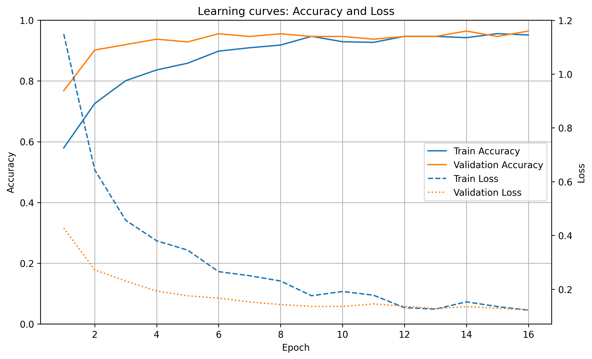
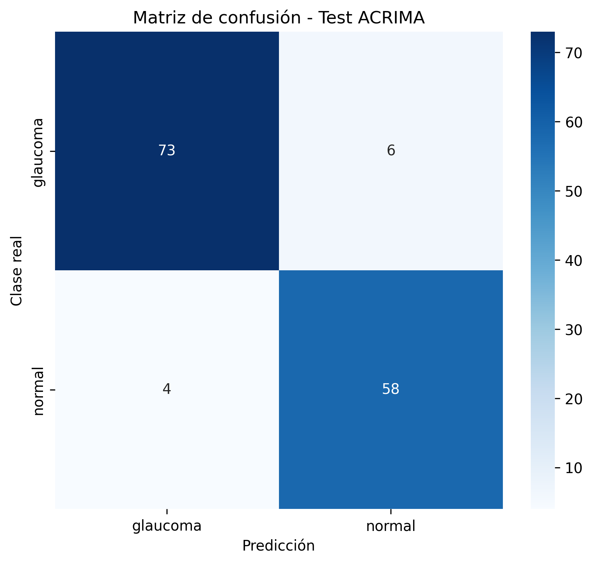
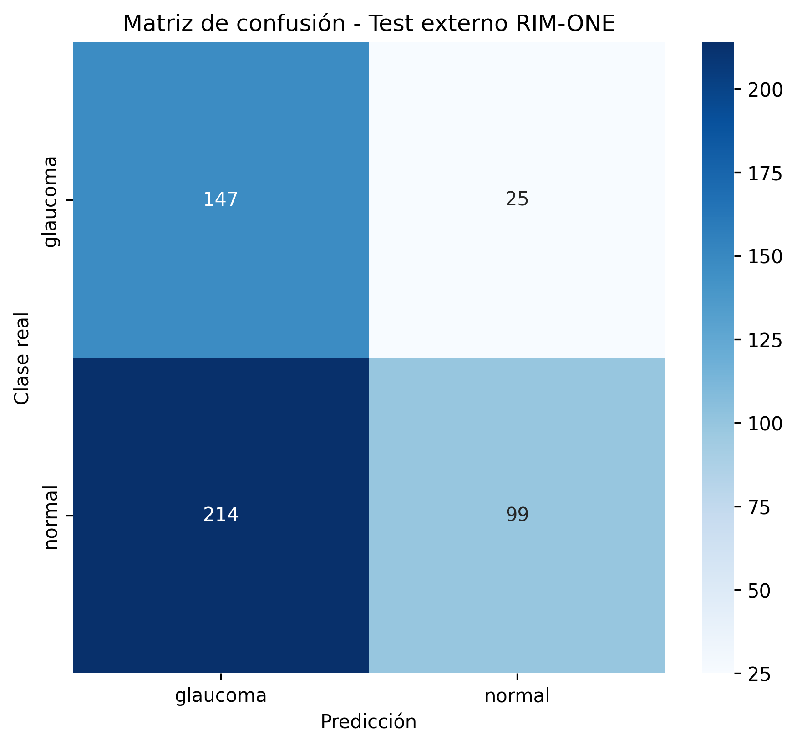
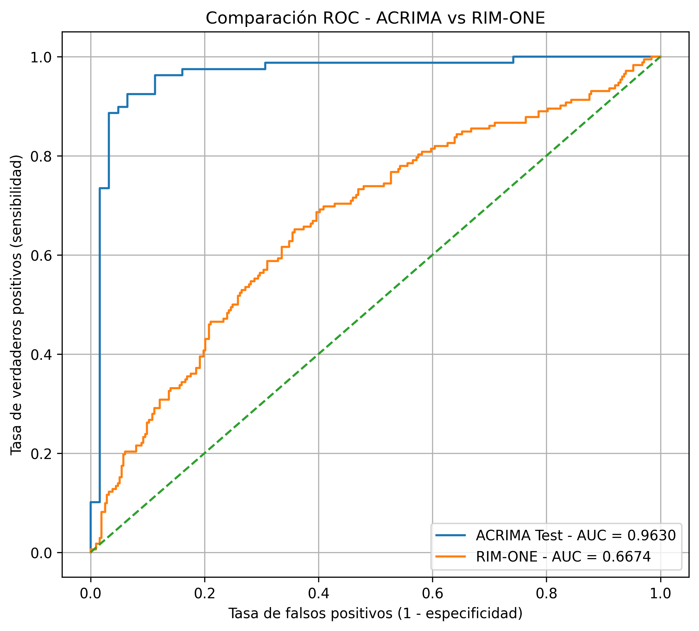
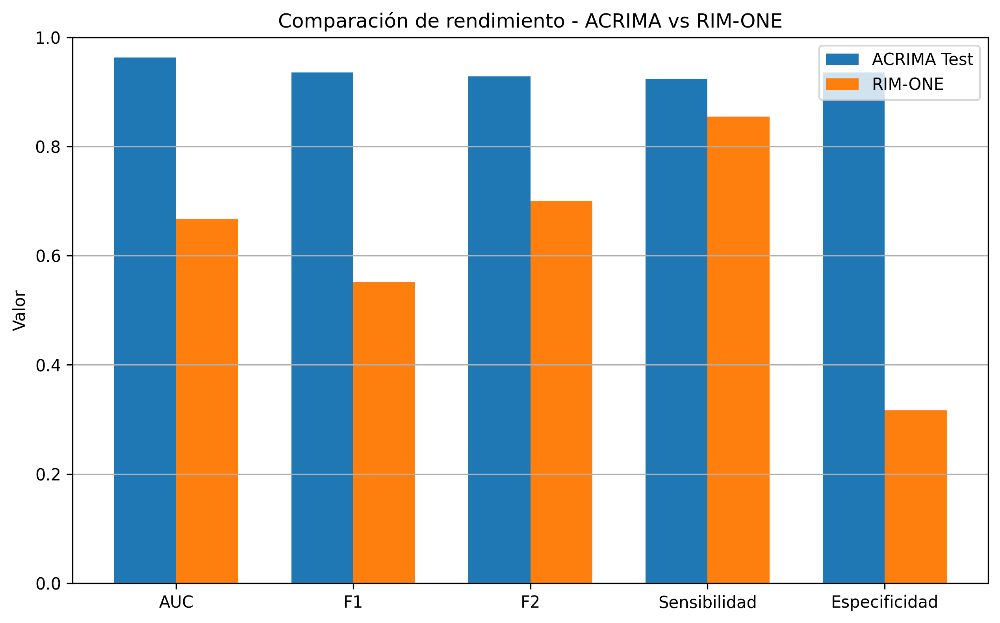
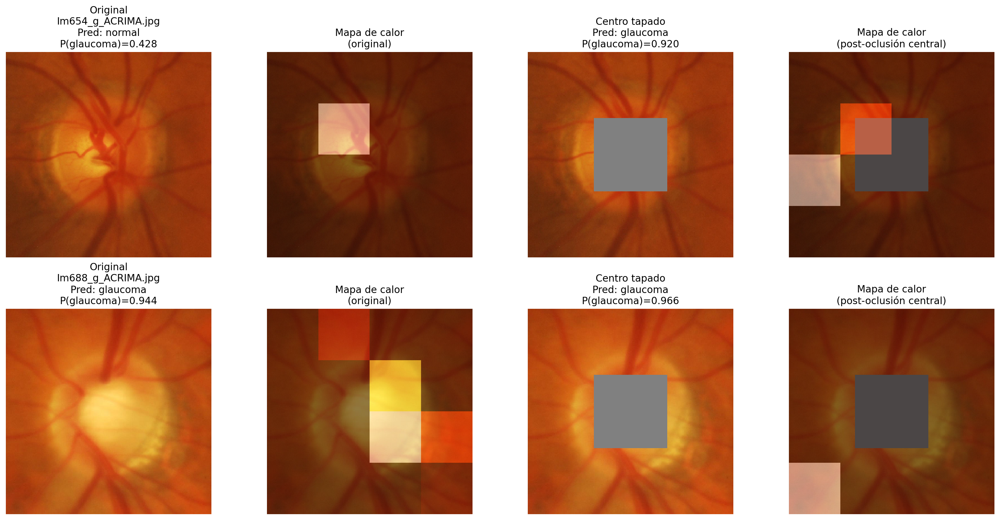

# Transferencia de aprendizaje en VGG16 para diagnóstico de glaucoma

Este proyecto evalúa el uso de una red neuronal convolucional **VGG16** para clasificar retinografías en dos clases: **glaucoma** y **normal**. Se comparan tres escenarios: una VGG16 preentrenada con ImageNet sin adaptación médica, una VGG16 adaptada mediante transferencia de aprendizaje con ACRIMA y la evaluación externa del modelo en RIM-ONE-R2.

El objetivo principal es comprobar si un modelo entrenado con imágenes generales puede adaptarse al diagnóstico de glaucoma y si el rendimiento obtenido en una base de datos se mantiene al aplicarse sobre imágenes de otra fuente.


## Base de datos

La base principal utilizada fue **ACRIMA**, disponible en Kaggle:

https://www.kaggle.com/datasets/ayush02102001/glaucoma-classification-datasets

Por tamaño y licencia, las imágenes no se incluyen en este repositorio. Para reproducir el proyecto, se deben descargar manualmente desde Kaggle y organizar dentro de una carpeta local llamada `data_set`.

La estructura esperada para ACRIMA es:

```text
data_set/
└── ACRIMA/
    ├── Training/
    │   ├── glaucoma/
    │   └── normal/
    ├── dev/
    │   ├── glaucoma/
    │   └── normal/
    └── Testing/
        ├── glaucoma/
        └── normal/
```

Para la evaluación externa se utilizó **RIM-ONE-R2**, organizada de forma equivalente:

```text
data_set/
└── RIM-ONE/
    ├── glaucoma/
    └── normal/
```
Es importante que las carpetas de clase se llamen exactamente:

glaucoma
normal


---

## Metodología

Primero se evaluó una **VGG16 preentrenada con ImageNet** sin entrenamiento específico para glaucoma. Esta prueba sirvió como línea base.

Después se aplicó **transferencia de aprendizaje**: se reutilizó la base convolucional de VGG16 con pesos de ImageNet, se congelaron sus capas y se entrenaron nuevas capas finales con imágenes de ACRIMA.

Finalmente, el modelo entrenado en ACRIMA se evaluó sobre **RIM-ONE-R2** sin reentrenamiento, para explorar su capacidad de generalización.

---

## Arquitectura del modelo

El modelo final se construyó mediante **transferencia de aprendizaje** a partir de VGG16. Se reutilizó la base convolucional preentrenada con ImageNet, eliminando su clasificador original y manteniendo congeladas sus capas convolucionales. De esta forma, la red conserva su capacidad general para extraer patrones visuales, pero se adapta al problema específico de clasificación glaucoma/normal mediante nuevas capas finales entrenadas con ACRIMA.

La entrada del modelo son imágenes RGB redimensionadas a **224 × 224 × 3**. La salida de la base VGG16 tiene dimensión **7 × 7 × 512** y se resume mediante una capa de **Global Average Pooling 2D**. Después se añadieron dos capas densas de **512** y **256** neuronas con activación ReLU, una capa de **Dropout = 0.5** para reducir sobreajuste y una capa final de **2 neuronas con Softmax**, que devuelve la probabilidad de cada clase: glaucoma o normal.


---

## Resultados principales

### VGG16 ImageNet sin adaptación médica

La VGG16 preentrenada con ImageNet obtuvo una precisión global aproximada del **55%**. Aunque detectaba muchos casos de glaucoma, confundía demasiadas imágenes normales con glaucoma. Esto mostró que una red entrenada con imágenes generales no es suficiente para resolver directamente un problema médico específico.

---

### VGG16-glaucoma entrenada con ACRIMA

Tras aplicar transferencia de aprendizaje, el rendimiento mejoró claramente. En el conjunto de test de ACRIMA, el modelo alcanzó una precisión global del **92.91%**, con alta sensibilidad y alta especificidad.

También obtuvo:

- **AUC = 0.9630**: mide la capacidad del modelo para separar correctamente imágenes con glaucoma de imágenes normales. Cuanto más cercano a 1, mejor discrimina.
- **F2-score = 0.9288**: métrica útil en medicina porque da más peso a detectar correctamente los casos positivos, reduciendo falsos negativos.





---

### Evaluación externa en RIM-ONE-R2

Al aplicar el modelo en RIM-ONE-R2 sin reentrenamiento, el rendimiento cayó de forma importante. La precisión global bajó a **0.5072**, el **AUC a 0.6674** y el **F2-score a 0.7007**.

El modelo seguía detectando muchos casos de glaucoma, pero generaba demasiados falsos positivos, clasificando imágenes normales como glaucomatosas. Esto indica que aprendió bien dentro de ACRIMA, pero no generalizó de forma robusta a otra base de datos.







---

## Análisis visual por oclusión

Se realizó un análisis visual mediante mapas de calor por oclusión. Este método tapa regiones de la imagen y observa cuánto cambia la predicción del modelo. Si al ocultar una zona cambia mucho la probabilidad de glaucoma, se interpreta que esa región influye en la decisión.



Este análisis mostró que el modelo utiliza zonas próximas al disco óptico, aunque en algunos casos también parece apoyarse en regiones periféricas. Esto refuerza la necesidad de interpretar el modelo con cautela.

---

## Conclusión

La transferencia de aprendizaje con VGG16 funcionó bien dentro de ACRIMA, pero el modelo no generalizó correctamente a RIM-ONE-R2. La principal limitación fue el aumento de falsos positivos en la base externa.

Una explicación plausible es el cambio de dominio entre bases de datos: diferencias en iluminación, contraste, resolución, calidad de imagen, tipo de cámara o centrado del disco óptico. Por ello, este modelo debe entenderse como un prototipo académico, no como una herramienta clínica autónoma.

Para mejorar la generalización sería necesario entrenar con imágenes de varias fuentes, aplicar una normalización más estricta y realizar validaciones externas más amplias.

---

## Scripts

### `01_vgg16_imagenet_acrima.py`

Evalúa una VGG16 preentrenada con ImageNet sobre ACRIMA sin entrenamiento específico.

### `02_large_trainning.py`

Entrena la VGG16-glaucoma mediante transferencia de aprendizaje con ACRIMA y evalúa el modelo en ACRIMA y RIM-ONE-R2.

### `03_oclusion.py`

Genera mapas de calor por oclusión para interpretar qué zonas de la retinografía influyen más en la predicción.

---

## Modelo guardado

El modelo entrenado se incluye como:

custom_vgg16_model.keras

Puede cargarse con Keras:

from tensorflow import keras

model = keras.models.load_model("custom_vgg16_model.keras", compile=False)

---

## Ejecución

Evaluar la VGG16 preentrenada con ImageNet:

python 01_vgg16_imagenet_acrima.py

Entrenar y evaluar la VGG16-glaucoma con transferencia de aprendizaje:

python 02_large_trainning.py

Generar mapas de calor por oclusión:

python 03_oclusion.py
